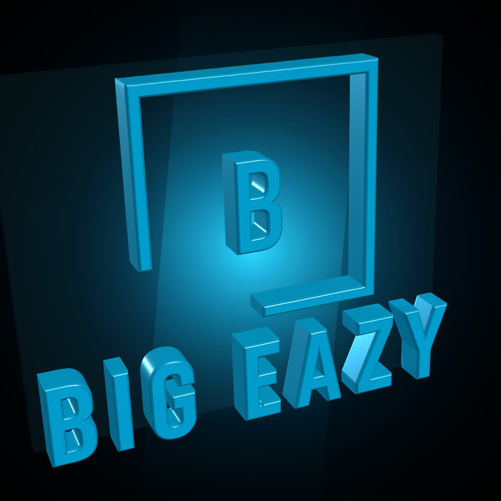
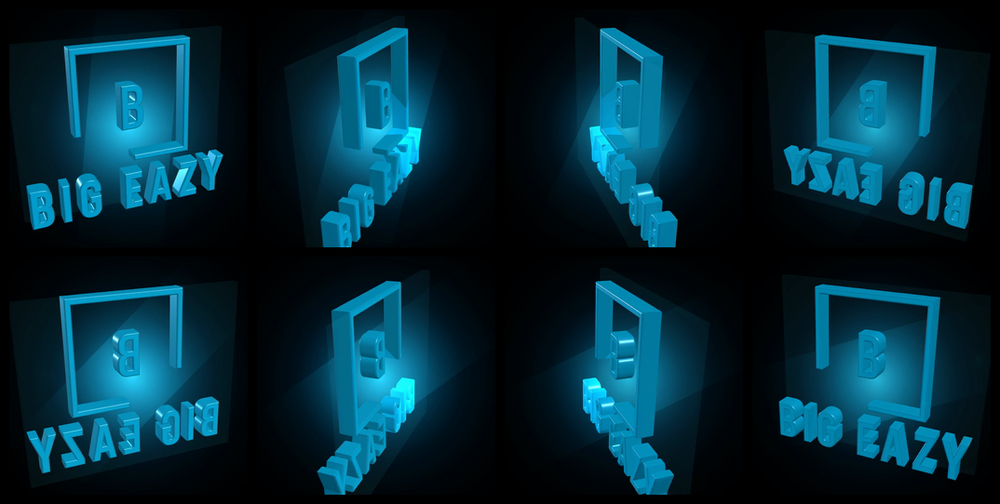

# Big Eazy SpinDisplay Asset Pipeline

This workspace turns the original Big Eazy logo vector into a simplified SpinDisplay-ready 3D asset and a looping square master render.

## Render Preview

### Spin Preview


### Still Frame



### Contact Sheet



## Outputs

- Simplified motion SVG: [source/big-eazy-spindisplay.svg](source/big-eazy-spindisplay.svg)
- Reusable 3D asset: [source/big-eazy-spindisplay.glb](source/big-eazy-spindisplay.glb)
- Preview still: [renders/big-eazy-spindisplay-preview.png](renders/big-eazy-spindisplay-preview.png)
- Master loop: [renders/big-eazy-spindisplay-master.mp4](renders/big-eazy-spindisplay-master.mp4)
- Preview GIF: [renders/big-eazy-spindisplay-preview.gif](renders/big-eazy-spindisplay-preview.gif)
- Contact sheet: [renders/big-eazy-spindisplay-contact-sheet.png](renders/big-eazy-spindisplay-contact-sheet.png)
- ffprobe metadata: [renders/big-eazy-spindisplay-master.ffprobe.json](renders/big-eazy-spindisplay-master.ffprobe.json)
- Original logo sources: [547227273_122137993856924986_8556302376693794118_n.svg](547227273_122137993856924986_8556302376693794118_n.svg), [547227273_122137993856924986_8556302376693794118_n.ai](547227273_122137993856924986_8556302376693794118_n.ai), [547227273_122137993856924986_8556302376693794118_n.eps](547227273_122137993856924986_8556302376693794118_n.eps), [547227273_122137993856924986_8556302376693794118_n.pdf](547227273_122137993856924986_8556302376693794118_n.pdf), [547227273_122137993856924986_8556302376693794118_n.dxf](547227273_122137993856924986_8556302376693794118_n.dxf)

## Build

Install dependencies:

```bash
npm install
npx playwright install chromium
```

Generate the simplified SVG only:

```bash
npm run derive:svg
```

Generate the `.glb`, preview still, MP4 loop, GIF, and contact sheet:

```bash
npm run build:spin
```

## Render Defaults

- `1024x1024`
- `30 fps`
- `8 seconds`
- black background
- H.264 MP4
- no audio

## Notes

- The original SVG is left untouched.
- The SpinDisplay version intentionally drops the small tagline for readability on hologram fan displays.
- The build script captures a square master render that can be transcoded later for a specific SpinDisplay model.
- The public repo includes the original logo source files and the generated render assets. Only local install artifacts like `node_modules/` and OS metadata are excluded.
